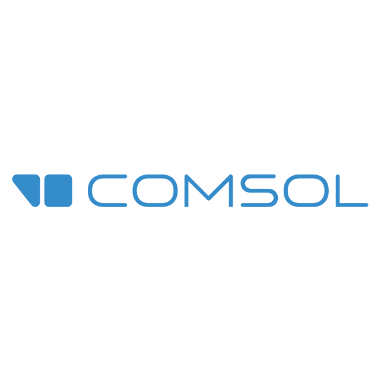

# Hello! 🪸

My name is Vasilis and I'm a PhD student at the [Department of Mathematics, University of Patras](https://www.upatras.gr/en/)!

## I speak:

 
 
 

## I use:

 
 

<!--
**TsilidisV/TsilidisV** is a ✨ _special_ ✨ repository because its `README.md` (this file) appears on your GitHub profile.

Here are some ideas to get you started:

- 🔭 I’m currently working on ...
- 🌱 I’m currently learning ...
- 👯 I’m looking to collaborate on ...
- 🤔 I’m looking for help with ...
- 💬 Ask me about ...
- 📫 How to reach me: ...
- 😄 Pronouns: ...
- ⚡ Fun fact: ...
-->
